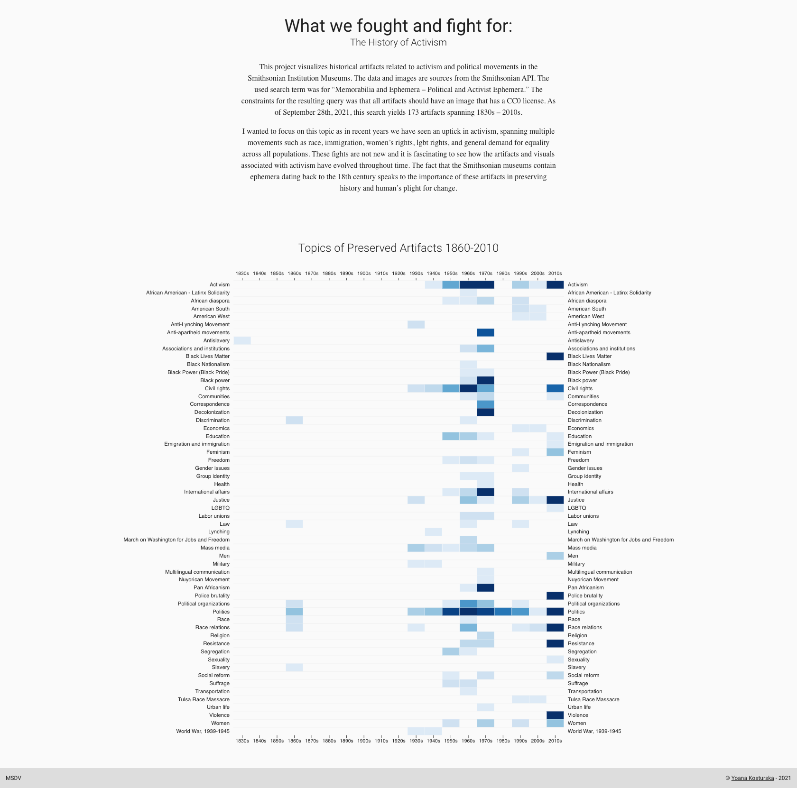
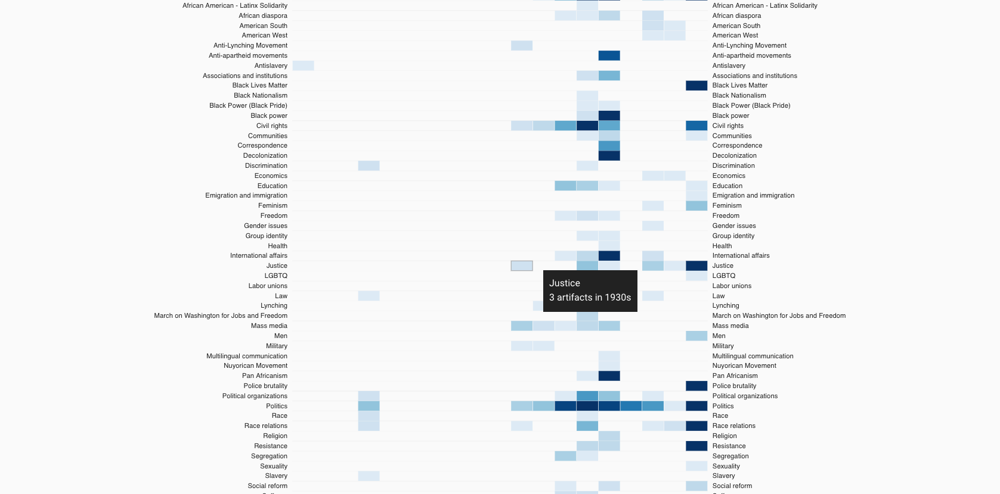
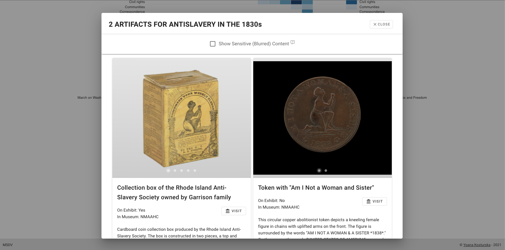
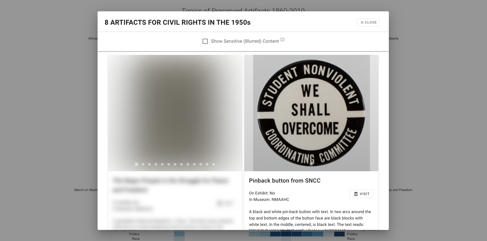
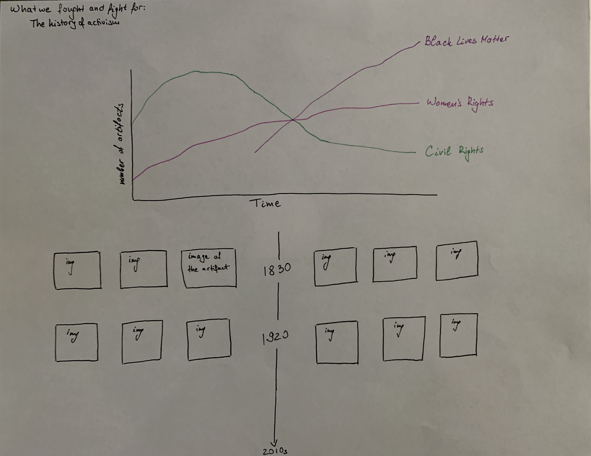

### What We Fought and Fight For: The History of Activism

##### Quantitative project in collaboration with Smithsonian Institution

This project visualizes the memorabilia and ephemera artifacts in the Smithsonian Institution dating 1830s-2010s. The concept of the project is to present the topics that engaged the public throughout time, allowing the user to explore and make comparisons for different political and social justice movements. 

This project visualizes historical artifacts related to activism and political movements in the Smithsonian Institution Museums. The data and images are sources from the Smithsonian Open access API. The used search term was “Memorabilia and Ephemera – Political and Activist Ephemera.” The constraints for the resulting query was that all artifacts should have an image that has a CC0 license. As of September 28th, 2021, this search yields 173 artifacts spanning 1830s – 2010s.

The project utilizes a heatmap that represents the amount of artifacts collected by the Smithsonian Institution since 1830s by the topic they are related to. The topics are exposed on the y axis, and the dates on the x axis of the heatmap. The amount of artifacts per topic in the specific time period is represented by color, and the more artifacts available for the specific topic and time period, the darker the color. 

I also implemented a tooltip in order to enhance readibility and allow the user to easily see the topic and year they are hovering over. 

On click of each cell, a modal window opens, and the user can explore all artifacts falling into the chosen topic and time period. All artifacts have their images and titles exposed, link to the original record in Smithsonian's website, and metadata - museum that holds the artifact, if the item is on exhibit, description. 

Due to the content in the project, some of the artifacts contain inapropriate language. In order to preserve the integrity of the dataset, I blurred the images and information of artifacts containing sensitive language. A checkbox at the top of the modal window allows the user to reveal the blurred content at their own discretion. 

My initial idea was to visualize the data as a multiline chart, however, due to the many outliers in the data, for example topics which occur only in one decade, a line chart was not the appropriate type of visualization.

